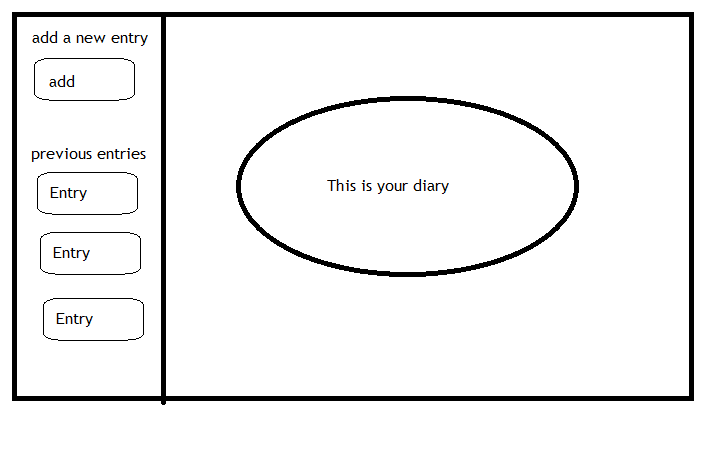
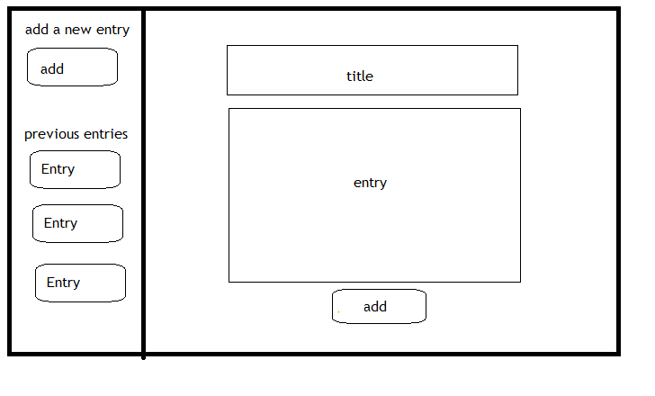
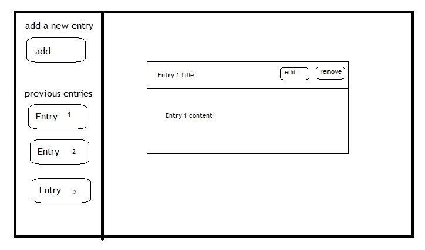

# Unit 3, Project 3. Full Crud App With React Front-end
##  Dear Diary
Dear Diary is an app for young and old, to chronicle their day to day lives.

##  Technologies used
This is a full CRUD app using:
-  node.js
-  npm
-  express or Firebase...I have not decided yet
-  MongoDB
-  Mongoose
-  MLab
-  jQuery
-  Bootstrap

## User Stories/MVP
- I can click to add a new entry.
- I can click to view previous entries.
- I can click to edit previous entries.
- I can click to delete previous entries.

## User Stories/Stretch
- I can log in using google.
- I can search entries using keyword.
- I can utilize time stamp.

## Trello
-  [Check out my Trello Board](https://trello.com/b/xnTRzoAr/react-firebase-app)

##  Wireframes
###  Homepage

###  New Entry

###  View Previous

